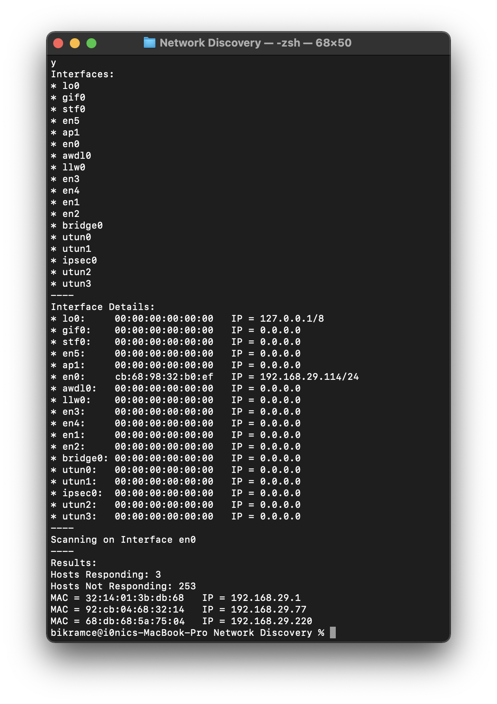
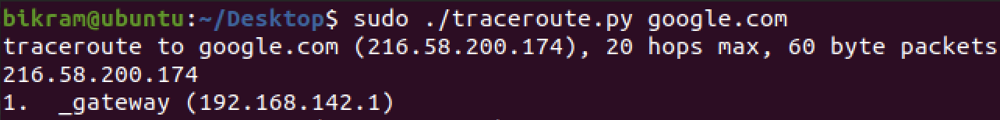
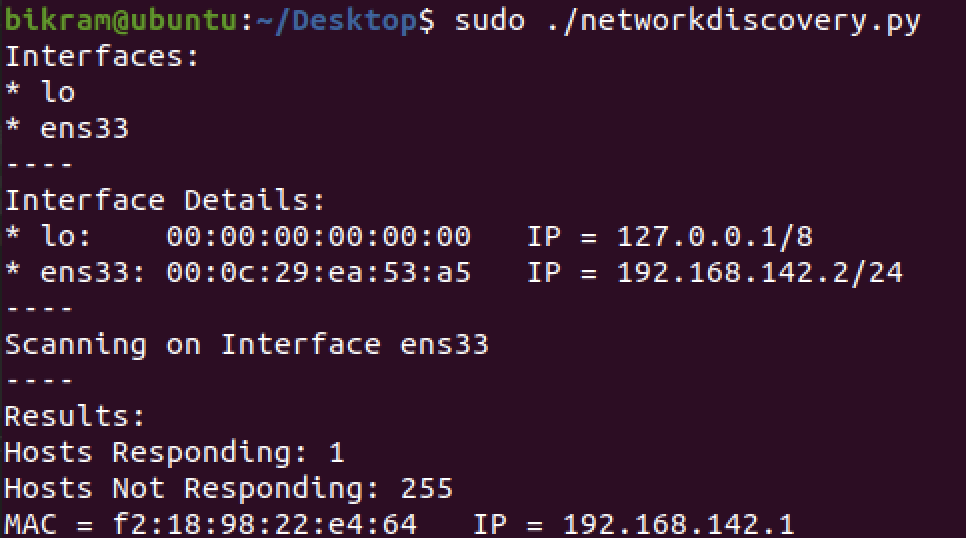

[![MIT License][license-shield]][license-url]
[![LinkedIn][linkedin-shield]][linkedin-url]
 
<h1 align='center'> Network Scanner</h1>

Network Discovery | Traceroute | TCP and UDP Port Scanner

<h2 id='about'>About The Project</h2>

<h3>Network Discovery</h3>

This program lists all available interfaces present in the host’s LAN and uses Scapy to identify all online machines accessible through each of the localhost’s non-virtual interfaces. To achieve this, this program creates an ethernet frame that encapsulates an ARP packet. The Ethernet frame has its destination address set to the broadcast address while the ARP packet has the localhost's subnet address along with the CIDR notation. Finally, Scapy creates a list of ARP packets that are broadcasted to every IP address in the subnet and prints the MAC and IP addresses of the online machines which send a reply back to the localhost.

<h3>Traceroute</h3>

This traceroute program accepts either the destination IP address or hostname from the user and identifies the IP addresses or possible hostnames of all intermediary machines in between the source and destination. First, this tool identifies if the user has entered an IP address or hostname and finds the respective hostname or IP address accordingly. Next, it creates an IP datagram encapsulating a UDP packet with random destination ports in the range of 33434 - 33464 along with random high number source ports. The IP destination address is either directly provided by the user or is obtained using the hostname provided by the user via Scapy. The max hop is set to 20 and the TTL increases in accordance with the current hop number so that all intermediary machines in the path with a distance less than or equal to 20 hops can be discovered. Finally, it sends and receives the packets from one hop to the next and reports the hostname and IP address present in the response packet. If a packet is not acknowledged within the expected timeout of 3 seconds, the packet is sent one more time. Otherwise, a '*' is printed. The program stops as soon as it receives an ICMP Port Unreachable message (type 3) from the target which signifies that the packet has reached the destination and the destination port is no longer open.

<h3>Port Scanner</h3>

This program identifies the status of transport layer ports. To accomplish this, it uses the argparse module to get info about the desired ports, target, protocol, etc. from the user and then checks for any invalid port ranges. The program also uses the socket module to check if the target is valid. Next, if the user chooses a TCP scan, an IP datagram containing a TCP SYN packet is sent to all the desired ports of the desired IP. If the program receives a TCP SYN-ACK packet back from the host, then the program determines that the port is open. If the program receives a TCP RST packet, then the port is determined to be closed. If no answer is received within 5 seconds, then the port is marked as filtered. If the user chooses a UDP scan and port 53 is included in the user's desired port range, then a UDP packet containing a DNS query to apple.com is sent. For all other ports, a UDP packet with a dummy payload is sent. If the program receives either a DNS or UDP reply, then the port is determined to be open. If the port receives an ICMP unreachable or ICMP port unreachable error, then the port is determined to be closed. If there is no response from the port, it is determined to be Open|Filtered.

<h2 id='license'>License</h2>

Distributed under the MIT License.

[license-shield]: https://img.shields.io/github/license/othneildrew/Best-README-Template.svg?style=for-the-badge
[license-url]: https://github.com/i0nics/network-scanner-python/blob/main/LICENSE
[linkedin-shield]: https://img.shields.io/badge/-LinkedIn-black.svg?style=for-the-badge&logo=linkedin&colorB=555
[linkedin-url]: https://linkedin.com/in/bikramce
