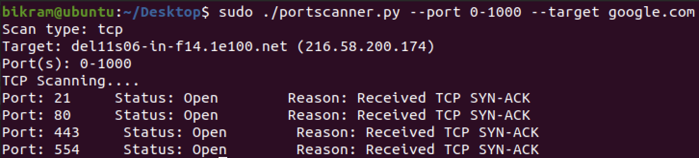

[![MIT License][license-shield]][license-url]
[![LinkedIn][linkedin-shield]][linkedin-url]
 
<h1 align='center'> Network Scanner</h1>

Network Discovery | Traceroute | TCP and UDP Port Scanner

<h2 id='about'>About The Project</h2>

* Developed network discovery tool that identifies all online interfaces that reside in host's LAN using Scapy
* Built UDP-based traceroute program identifies IP addresses of all machines between source and destination
* Wrote Python script and utilized Scapy to identify the status of transport layer ports such as TCP and UDP

<h2 id='sc'>Screenshots</h2>

1) Network Discovery

2) Traceroute

3) Port Scanner

<h2 id='license'>License</h2>

Distributed under the MIT License.

[license-shield]: https://img.shields.io/github/license/othneildrew/Best-README-Template.svg?style=for-the-badge
[license-url]: https://github.com/i0nics/network-scanner-python/blob/main/LICENSE
[linkedin-shield]: https://img.shields.io/badge/-LinkedIn-black.svg?style=for-the-badge&logo=linkedin&colorB=555
[linkedin-url]: https://linkedin.com/in/bikramce
